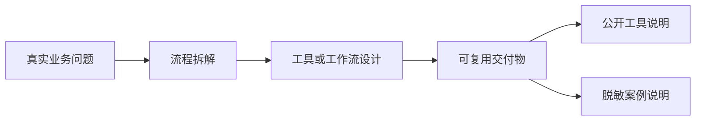

# AI Workflow & Digital Operations Portfolio

> 关注把品牌、内容和运营中的重复流程拆解成可复用的 AI 工具、RPA 流程、Agent 工作流和标准化 SOP。

## 能力概览

- 业务流程拆解：从真实岗位动作中识别高频、重复、可标准化的环节。
- AI 工具落地：将需求转化为 Prompt、Skill、Agent、脚本或本地 Web 工具。
- 内容与品牌理解：覆盖短视频脚本、品牌文稿审核、舆情监控、门店内容 SOP 等场景。
- 交付与维护：关注输入输出格式、人工复核边界、测试样例、交接文档和后续迭代。

## 作品集结构

本仓库只展示通用方法、架构和职责边界，不包含公司内部资料、真实运行数据、账号凭据或未脱敏业务文件。

## 项目与案例

| 项目 | 类型 | 说明 |
| --- | --- | --- |
| [AI 视频封面生成工具](cases/01-ai-cover-generator.md) | Web 工具 + Skill | 根据主素材、标题、参考图生成短视频封面候选，并设计文字/logo 兜底机制 |
| [电商主图视频分镜脚本生成器](cases/02-video-commerce-script.md) | 自动化脚本 + Skill | 从对标视频和产品信息生成拍摄/剪辑可用的分镜脚本 |
| [多模型文稿审议工作流](cases/03-multi-agent-review-workflow.md) | Agent 工作流 | 通过多模型独立审议、交叉审查和事实账本降低文稿误用事实的风险 |
| [AI 搜索可见性监测](cases/04-ai-search-visibility-monitor.md) | 数据采集 + Dashboard | 监测品牌在 AI 问答场景中的出现、推荐、排序和引用情况 |
| [品牌舆情监控流程](cases/05-public-opinion-monitoring.md) | 数据采集 + 审核流程 | 从公开来源召回线索，经过过滤、摘要、证据留存和人工复核后入表 |
| [品牌声音 Skill 模板](cases/06-brand-voice-skill-template.md) | 知识蒸馏 + Skill | 将表达规则、事实边界和输出模式结构化为可复用的文稿工具 |

## 使用边界

- 公开内容只保留脱敏后的问题定义、方案结构、技术路径和职责说明。
- 不展示真实品牌资料、人物语料、业务数据、内部文档、截图、表格或账号路径。
- 涉及事实判断、舆情判断、品牌表达和内容合规的场景，都保留人工复核环节。
