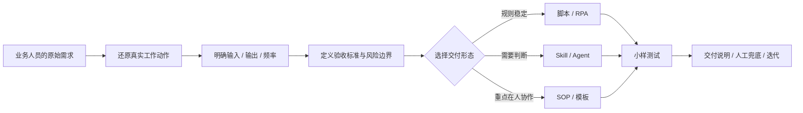

# AI Workflow & Digital Operations Portfolio

> 把品牌、内容和运营中的模糊需求，拆成可验证、可交付、可复用的 AI 应用、自动化流程与标准化机制。

**目标方向：数字化运营 / AI 工具运营 / 技术运营**

`需求拆解` · `流程设计` · `AI / RPA 落地` · `测试与交接`

## 我如何处理一个需求

我不会从“该用哪个模型”开始，而是先判断需求发生在哪里、谁在使用、输入是否稳定、结果如何验收，以及失败时谁负责兜底。

| 原始需求 | 关键判断 | 最终工作流 |
| --- | --- | --- |
| “给素材和标题，直接生成能用的封面” | 不是一次性 Prompt；需要稳定输入、候选对比、文字与 Logo 兜底 | 本地 Web 工具 + Skill + 导出流程 |
| “让几个 AI 一起审稿，别乱写数据” | 多模型数量不是重点；事实状态和发布关卡才是风险核心 | 独立审议 + 交叉审查 + 事实账本 + 最终 QA |
| “看看品牌在 AI 回答里有没有出现” | 需要区分自然问题与点名问题，也要保留原始回答供复核 | 问题集 + 双源采集 + 指标计算 + 证据明细 + 复测 |

## 交付范围

- **20+ 项工具或流程实践**：覆盖内容生成、文稿审核、数据采集、舆情监测、AI 搜索可见性和批量处理等场景。
- **3 类主要形态**：Skill / Agent、Python 脚本、RPA 与本地 Web 工具。
- **完整交付意识**：需求台账、输入输出、验收标准、失败边界、使用说明与后续迭代。

## 旗舰项目

### 01 · AI 视频封面生成工具

**证据等级：`公开源码`**

从“生成一张封面”继续往下拆，补齐参考图解析、候选对比、标题安全区、Logo 策略和程序叠字兜底，形成可使用的本地 Web MVP。

[查看需求拆解与交付说明](cases/01-ai-cover-generator.md) · [查看公开源码](https://github.com/Baibaibin/ai-cover-generator)

### 02 · 多模型文稿审议工作流

**证据等级：`脱敏演示`**

把“多个 AI 一起看稿”转成带事实关卡、独立审议、交叉审查、仲裁和最终 QA 的流程，并为每个结果保留可发布或需要人工处理的状态。

[查看需求拆解、合成截图与样例证据](cases/03-multi-agent-review-workflow.md)

### 03 · AI 搜索可见性监测

**证据等级：`合成数据演示`**

把一次性的“问几个 AI 看看”转成问题集、采集结果、品牌识别、排名指标、证据明细和前后复测组成的监测链路。

[查看需求拆解、指标设计与样例数据](cases/04-ai-search-visibility-monitor.md)

## 其他案例

| 项目 | 交付形态 | 重点能力 | 公开程度 |
| --- | --- | --- | --- |
| [电商主图视频分镜脚本](cases/02-video-commerce-script.md) | Python + Skill | 对标视频拆解、关键帧、拍摄表格 | 架构说明 |
| [品牌舆情监控流程](cases/05-public-opinion-monitoring.md) | 数据采集 + 审核流程 | 宽召回、证据链、人工复核 | 架构说明 |
| [品牌声音 Skill 模板](cases/06-brand-voice-skill-template.md) | 知识结构化 + Skill | 语料优先级、模式和事实边界 | 架构说明 |

其他轻量交付还包括关键词数据采集、视频/文档批量处理、热点与选题采集等。它们用于解决明确的重复动作，不为凑项目数量逐项展开。

## 证据说明

- `公开源码`：可查看代码、运行说明和测试。
- `脱敏演示`：工作流来自真实业务项目，公开输入、输出和数据均为重新生成的虚构内容。
- `架构说明`：因涉及公司资料、平台账号或业务规则，只展示通用机制、个人职责和交付边界。

本仓库不包含公司内部资料、真实业务数据、账号凭据、未脱敏截图、个人联系方式或完整简历。涉及事实判断、舆情和品牌表达的流程均保留人工复核。
