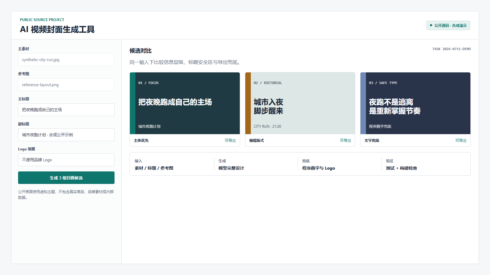
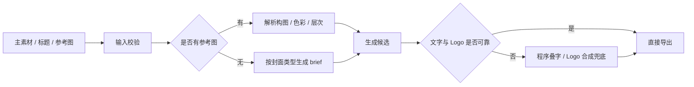

# AI 视频封面生成工具

**证据等级：`公开源码`** · [公开仓库](https://github.com/Baibaibin/ai-cover-generator) · [返回作品集首页](../README.md)



> 图片为公开展示用的合成界面，标题和候选封面均为虚构内容；真实项目的产品代码位于独立公开仓库。

## 需求如何出现

脱敏后的原始需求可以概括为：

> 提供一张主素材、一段标题和可选对标图，能否快速生成几张风格接近、可以直接发布的封面？

表面看是“写一个生图 Prompt”，实际交付对象是内容团队，因此还要解决素材输入、参考图理解、标题可读性、Logo 准确性和导出失败等问题。

## 如何拆解

| 维度 | 判断 |
| --- | --- |
| 使用者 | 内容策划、设计或视频运营 |
| 输入 | 主素材、标题、副标题、参考图、可选 Logo |
| 输出 | 多张可比较的封面候选及可下载文件 |
| 验收 | 主体清晰、标题可读、版式接近参考但不复刻、尺寸正确 |
| 主要风险 | 模型文字错误、Logo 变形、参考图照搬、生成失败 |
| 交付选择 | 本地 Web 工具承接稳定输入与导出；Skill 承接生成策略和第三方工具兼容 |

## 从需求到工作流



关键判断不是“哪条提示词效果最好”，而是哪些环节可以交给模型、哪些必须由程序保证确定性。

## 交付与验证

- Next.js 本地 Web MVP，包含参考图分析、封面生成、导出和任务文件访问接口。
- 两条生成链路：模型完整设计；程序叠字与 Logo 合成兜底。
- 可分发的 Skill，支持直接生成或仅输出第三方工具可用的完整提示词。
- 环境变量模板、测试、交接说明和安全上传边界。

公开仓库提供以下验证命令：

```powershell
npm run lint
npm run test
npm run build
```

## 个人职责

- 将封面生产需求拆成输入、分析、生成、对比和导出环节。
- 设计参考图解析、标题安全区和 Logo 使用策略。
- 实现 Web/API 流程、提示词结构和导出兜底。
- 整理测试、README、Skill 与交接材料。

## 公开边界

不公开真实商品素材、品牌 Logo、生成记录、API 凭据或团队内部需求。上图只用于展示工具交互与交付结构。
