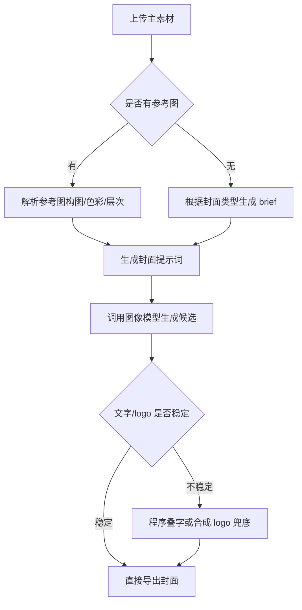

# AI 视频封面生成工具

## 项目定位

一个面向短视频内容生产的本地 Web MVP + Skill，用于根据主素材、标题、可选参考图和可选 logo 生成封面候选。

## 解决的问题

- 标题、主体画面、平台风格和品牌露出要求经常需要反复沟通。
- 参考图的构图、色彩和层次难以稳定迁移。
- AI 生成封面时，文字、logo 和留白区域容易不稳定。
- 纯 Prompt 交付缺少参数、导出和兜底逻辑。

## 方案结构

1. **素材输入层**：主图、参考图、标题、副标题、logo 策略。
2. **参考图解析层**：提取构图、光影、色彩、层次、真实感和不可复刻项。
3. **生成策略层**：根据封面类型选择提示词结构，决定是否预留 logo 或文字区域。
4. **导出兜底层**：当模型文字表现不稳定时，通过程序方式合成标题或 logo。

## 工作流图

## 技术与交付

- 本地 Web 工具与 API 路由设计
- 视觉/图像模型调用与 Prompt 结构设计
- Skill 双模式：直接生成图片，或输出可复制到第三方工具的提示词
- 配置、导出、文件处理和 Prompt 逻辑测试

## 个人职责

- 拆解封面生产流程并设计工具形态
- 设计参考图解析规则和封面生成规则
- 封装 Skill、整理 README、交接说明和安全上传边界

## 公开边界

本案例不包含真实业务素材、logo、生成产物、API Key 或团队内部文件。
