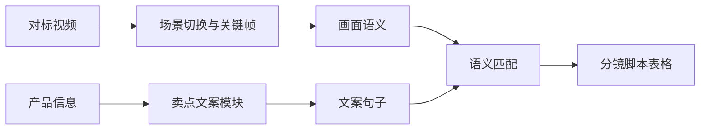

# 电商主图视频分镜脚本

**证据等级：`架构说明`** · [返回首页](../README.md)

## 需求与拆解

原始需求是“参考一条对标视频和产品卖点，生成拍摄团队能直接使用的分镜脚本”。难点不在写文案，而在把视频结构、产品信息和拍摄交付格式对应起来。

| 输入 | 对标视频、产品信息、卖点与合规要求 |
| --- | --- |
| 中间过程 | 场景切换检测、关键帧、画面理解、卖点文案拆分与语义匹配 |
| 输出 | 镜头序号、画面说明、口播/字幕、拍摄建议组成的表格 |
| 验收 | 每一行能被拍摄或剪辑人员理解；卖点不越过资料边界；镜头与文案对应 |

## 个人职责与交付

- 设计业务流程、分镜字段和验收格式。
- 实现关键帧提取与脚本生成流程。
- 设计文案规则、合规检查和交接说明。

不公开真实商品、对标视频、产品卖点、关键帧和内部拍摄需求。
