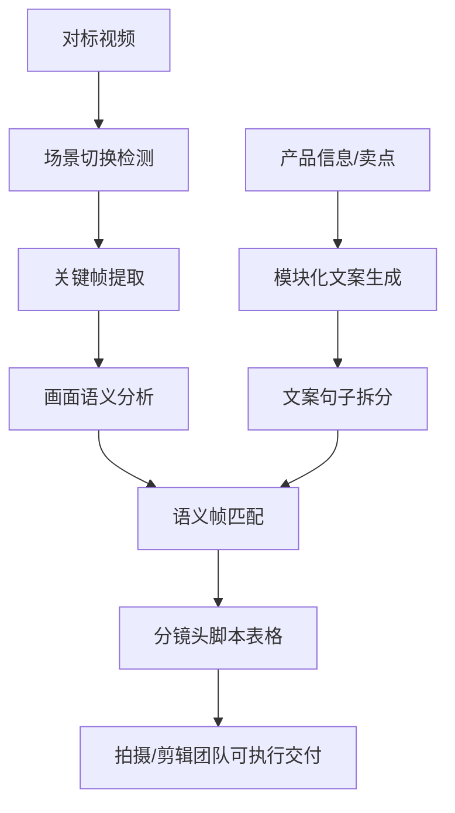

# 电商主图视频分镜脚本生成器

## 项目定位

一个 AI 辅助的电商短视频分镜脚本生成工具。输入对标视频和产品信息，输出可交付给拍摄/剪辑团队的分镜脚本。

## 解决的问题

- 看过对标视频后，仍难以拆成可执行脚本。
- 每个产品从零写卖点视频，效率低且质量不稳定。
- 文案、镜头和拍摄需求之间缺少统一格式。
- 交给拍摄或剪辑团队时沟通成本高。

## 方案结构

1. **关键帧提取**：根据场景变化提取代表画面。
2. **画面理解**：分析关键帧的主体、构图、场景和动作。
3. **卖点文案生成**：根据产品信息生成模块化短视频文案。
4. **语义匹配**：把文案句子和对标画面结构做匹配。
5. **分镜导出**：生成包含镜头、画面说明、文案、拍摄建议的表格。

## 工作流图

## 技术与交付

- Python 脚本与 OpenCV 关键帧/场景切换检测
- Excel/xlsx 结构化输出
- 文案模块、分镜格式和合规检查清单
- Skill 工作流说明和交付文档

## 个人职责

- 设计业务流程和分镜脚本格式
- 实现关键帧提取与脚本生成流程
- 设计文案生成规则、合规检查逻辑和交付文档

## 公开边界

本案例不使用真实商品、品牌素材、业务数据或内部拍摄需求。
