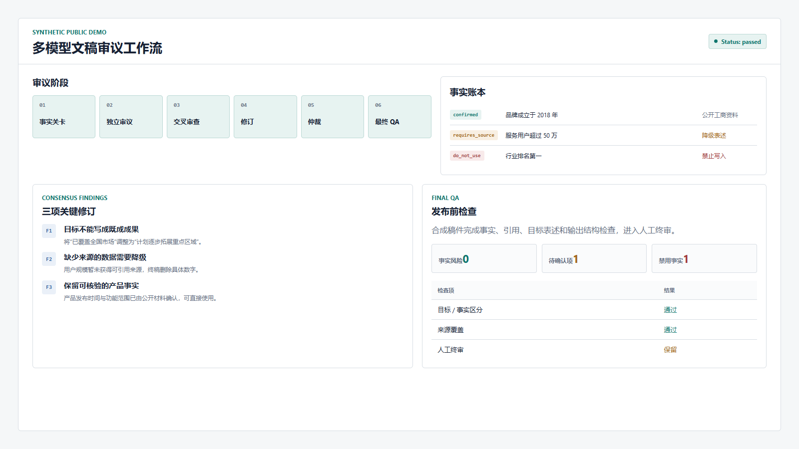
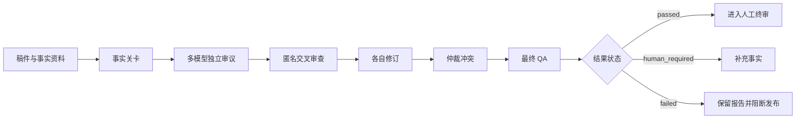

# 多模型文稿审议工作流

**证据等级：`脱敏演示`** · [查看演示稿件](../demos/ai-council/sample-draft.md) · [查看事实账本](../demos/ai-council/sample-fact-ledger.json) · [返回首页](../README.md)

> 项目机制来自真实品牌文稿审核场景；公开稿件、品牌、数据和审议结果均为重新生成的虚构示例。

## 需求如何出现

脱敏后的原始需求可以概括为：

> 同一篇稿件让多个 AI 分别检查，再互相核对，最后给出可以继续修改的版本；不能把目标写成成果，也不能乱用数据。

如果只是并排调用多个模型，最终仍然缺少统一事实口径、冲突处理和发布状态。因此真正的问题不是“模型数量”，而是审议协议和事实治理。

## 如何拆解

| 维度 | 判断 |
| --- | --- |
| 输入 | 原始稿件、任务类型、事实资料和可选专业审查规则 |
| 输出 | 审议报告、保守修订稿、事实处理清单、待人工确认项和最终状态 |
| 验收 | 模型独立判断；分歧可追踪；禁用事实不会进入终稿；失败状态明确 |
| 主要风险 | 模型互相跟风、共识不等于事实、目标与成果混淆、仲裁失败仍被当成通过 |
| 交付选择 | Agent 工作流负责多阶段判断；事实账本负责硬约束；最终 QA 只判断不改稿 |

## 从需求到工作流

事实账本将内容分为 `confirmed`、`attributed`、`requires_source`、`target`、`human_required` 和 `do_not_use` 等状态。共识只能帮助判断，不能越过事实关卡。

## 合成演示包含什么

- 一份虚构品牌的待审核稿件。
- 一份带可用、缺来源和禁止使用状态的事实账本。
- 一份展示关键修订、事实处理和最终 QA 状态的静态演示。

## 个人职责

- 设计审议协议、失败状态与最终报告结构。
- 编写主流程和模式配置。
- 设计事实账本 schema、审核规则和输出边界。
- 用真实文稿完成上线验证并整理同事使用说明。

## 公开边界

不公开真实品牌事实库、管理层语料、内部文稿、模型凭据和真实审议记录。合成演示不代表原项目业务结果。
