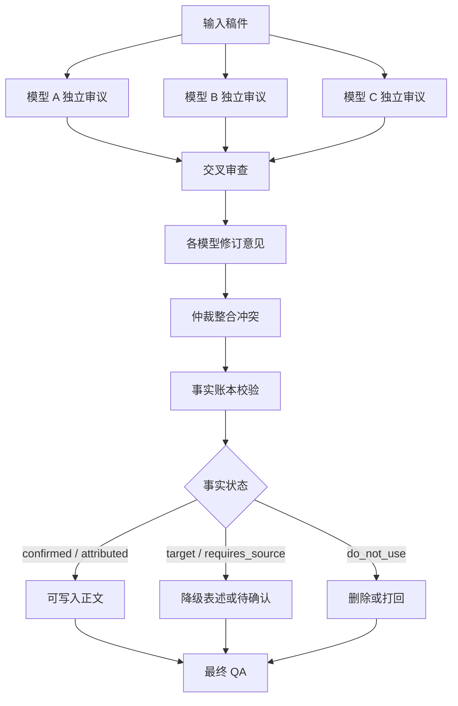

# 多模型文稿审议工作流（脱敏案例）

## 项目定位

一个用于品牌文稿、发言稿、PR 稿和方案评审的多模型协作工作流。多个模型分别审阅同一份材料，再进行交叉审查、修订、仲裁和最终质检。

## 背景问题

- 单模型容易自信地编造事实。
- 不同稿件对品牌事实、荣誉、数据、目标和口径要求不同。
- AI 容易把“目标”写成“已完成成果”。
- 人工审核缺少固定流程，容易漏掉高风险表达。

## 方案结构

## 核心机制

- **独立审议**：避免多个模型互相跟风。
- **交叉审查**：让模型指出其他模型漏掉的问题。
- **事实账本**：将事实分成 confirmed、attributed、target、requires_source、do_not_use 等状态。
- **仲裁与终审**：将分散意见整理为可执行修改建议。
- **动态事实清单**：无法确认的数据输出确认项，不自动编造。

## 个人职责

- 设计多模型审议流程
- 编写主脚本和模式配置
- 设计事实账本 schema、审核规则、输出格式和错误边界
- 完成上线验证和后续交接

## 公开边界

本案例只展示通用机制，不包含真实品牌事实库、管理层表达规则、内部文稿、上线案例或真实账号配置。

## 可迁移价值

可迁移到品牌文稿审核、公关稿风险检查、方案初审、内容合规审查和竞品分析报告互评等场景。
