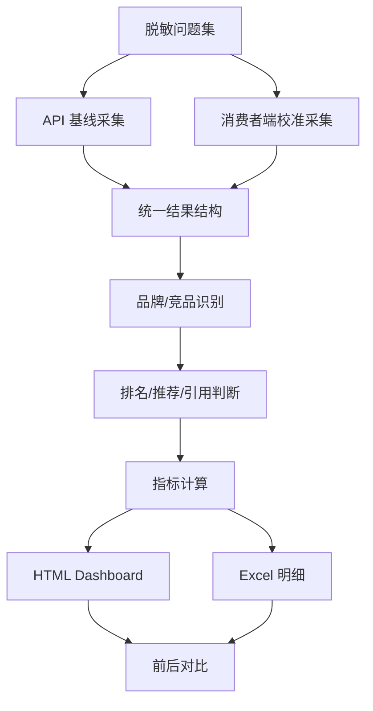

# AI 搜索可见性监测（脱敏案例）

## 项目定位

一个用于监测品牌在 AI 搜索/问答结果中是否被提及、推荐、排序和引用的工具。输出可视化仪表盘和 Excel 明细，辅助业务团队观察内容优化前后的变化。

## 背景问题

越来越多用户会直接向 AI 提问：某类产品哪个品牌好、某个品牌是否可靠、不同品牌有什么区别。业务团队需要知道品牌有没有被提到、排名靠不靠前、回答是否准确、是否引用了合适来源。

## 方案结构

## 指标设计

- Presence Rate：品牌是否出现
- Top3 Rate：品牌是否进入推荐前列
- MRR：品牌排名质量
- Citation Quality：引用来源是否可靠
- Answer Accuracy：回答是否符合事实口径
- Competitive Gap：竞品出现频次和位置差异

## 个人职责

- 设计问题集结构和结果 schema
- 编写采集、合并、分析和仪表盘脚本
- 区分 API 基线和消费者端校准结果
- 设计前后对比口径、断点续跑和证据导出

## 公开边界

本案例不包含真实品牌问题集、产品口径、采集结果、账号链接、下载入口或内部报告。

## 可迁移价值

可用于品牌 GEO/AI Search 监测、产品问答可见性评估、竞品位置追踪和内容优化复测。
