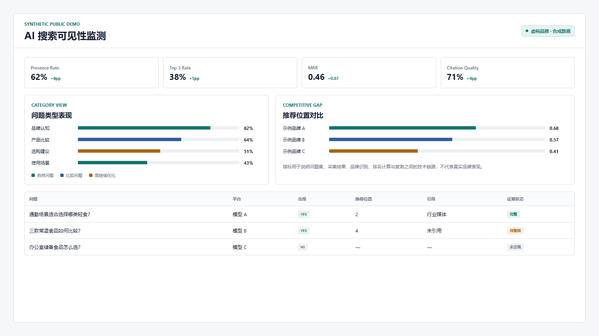
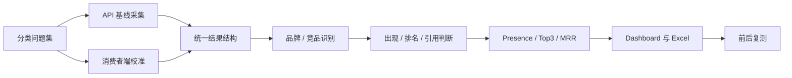

# AI 搜索可见性监测

**证据等级：`合成数据演示`** · [查看合成数据](../demos/geo-monitor/sample-data.json) · [返回首页](../README.md)

> 工具链来自真实监测项目；公开品牌、问题、平台名称和指标值均为合成示例，不代表真实业务表现。

## 需求如何出现

脱敏后的原始需求可以概括为：

> 想知道品牌在主流 AI 回答里有没有被提到、推荐位置如何，并能看内容调整前后有没有变化。

直接向几个模型提问只能得到一次性截图，无法比较、复测或说明回答为何被判定为“出现”。因此要先定义问题集、数据源、统一结构和证据口径。

## 如何拆解

| 维度 | 判断 |
| --- | --- |
| 观测对象 | 品牌是否出现、推荐位置、引用来源、回答准确性与竞品差距 |
| 输入 | 分类问题集、品牌/竞品词、采集配置与事实口径 |
| 输出 | HTML Dashboard、Excel 明细、原始回答证据和前后对比 |
| 验收 | 每个指标可回溯到问题和回答；点名问题与自然问题分开；支持重复采集 |
| 主要风险 | 点名提问抬高曝光、API 与消费者端结果混用、只给分数不给证据 |
| 交付选择 | API 基线负责稳定采集；消费者端校准观察真实产品差异；统一 schema 后计算指标 |

## 从需求到工作流

## 指标为什么这样设计

- **Presence Rate**：回答里是否出现目标品牌。
- **Top 3 Rate**：目标品牌进入推荐前列的比例。
- **MRR**：综合衡量品牌推荐位置，避免只看“有没有”。
- **Citation Quality**：引用来源是否存在且适合支撑结论。
- **Answer Accuracy**：回答是否符合已确认事实。
- **Competitive Gap**：目标品牌与竞品在同一问题集中的位置差异。

## 个人职责

- 设计问题集、结果 schema 与两类采集口径。
- 编写采集、合并、指标计算和仪表盘脚本。
- 设计断点续跑、前后对比和证据导出。
- 明确监测工具与内容策略之间的职责边界。

## 公开边界

不公开真实问题集、产品口径、模型回答、竞品结果、账号入口和内部报告。公开演示只证明信息结构和分析链路。
