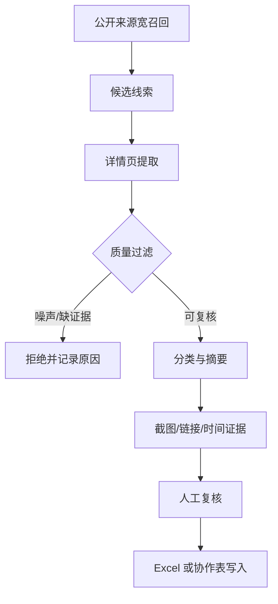

# 品牌舆情监控流程（脱敏案例）

## 项目定位

一个轻量的品牌舆情监控流程，用于从搜索引擎、内容平台和投诉平台发现公开线索，经过筛选、详情提取、人工/AI 审核后写入本地表格或协作系统。

## 背景问题

品牌团队需要及时发现搜索结果、投诉平台、社交媒体和内容平台中的高风险线索。但人工搜索和登记容易遗漏，不同来源格式也不统一。

## 方案结构

## 关键设计

- **宽召回 + 质量过滤**：先尽量发现，再过滤噪声。
- **统一数据模型**：不同平台都转成统一候选结构。
- **人工复核优先**：不把关键词命中直接当舆情结论。
- **平台安全边界**：遇到登录、验证码、风控时暂停，不绕过平台限制。
- **证据链留存**：链接、时间、来源、截图和摘要分开存储。

## 个人职责

- 设计采集、过滤、详情提取和入表流程
- 编写平台适配、质量过滤和摘要脚本
- 设计测试用例、运行边界和写入前审核规则
- 完成交接文档

## 公开边界

本案例不包含真实品牌名、风险词组合、舆情线索、截图、表格结构、文档 ID、用户 ID、登录态或 Cookie。

## 可迁移价值

可迁移到品牌舆情监控、客诉线索整理、竞品动态追踪和内容平台低频巡检。
