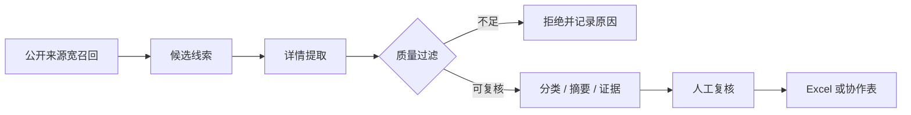

# 品牌舆情监控流程

**证据等级：`架构说明`** · [返回首页](../README.md)

## 需求与拆解

原始需求是“定期发现多个公开平台上的品牌风险线索并写入协作表”。如果仅用关键词命中直接入表，会混入大量无关内容，也可能把未经核实的信息当成结论。

| 输入 | 品牌词、风险词、公开来源和采集频率 |
| --- | --- |
| 中间过程 | 宽召回、详情提取、时间与主体识别、质量过滤、分类摘要 |
| 输出 | 带来源、链接、时间、截图和审核状态的候选记录 |
| 验收 | 无详情或证据不足不入正式表；重复链接去重；最终判断保留人工复核 |

## 个人职责与边界

- 设计采集、过滤、详情提取、证据留存和入表流程。
- 编写来源适配、质量过滤、摘要和去重逻辑。
- 遇到登录、验证码或平台风控时停止，不绕过安全机制。

不公开品牌词、风险词组合、真实线索、截图、表格 ID、登录态和平台凭据。
