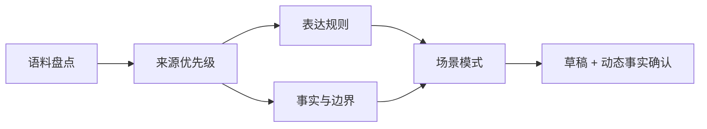

# 品牌声音 Skill 模板

**证据等级：`架构说明`** · [返回首页](../README.md)

## 需求与拆解

原始需求是“让 AI 写出的口播、发言稿和内部意见更接近同一个品牌人物”。单纯模仿语气容易只学到句式，还会混淆运营提炼、真实原话和动态事实。

| 输入 | 原声、公开采访、正式发言和内部已确认材料 |
| --- | --- |
| 中间过程 | 来源分级、表达规则、判断原则、场景模式与事实边界 |
| 输出 | IP 口播、正式发言、内部评议等不同模式的草稿和确认清单 |
| 验收 | 不编造事实；不同场景不混用语体；运营总结不标成原话 |

## 个人职责与边界

- 设计 Skill 结构、触发条件、三类输出模式和审核规则。
- 将一次性写稿经验沉淀为可复用的知识与流程。
- 保留动态事实核验和人工终审。

不公开真实人物原声、表达规则全文、内部事实库、战略目标和会议材料。
