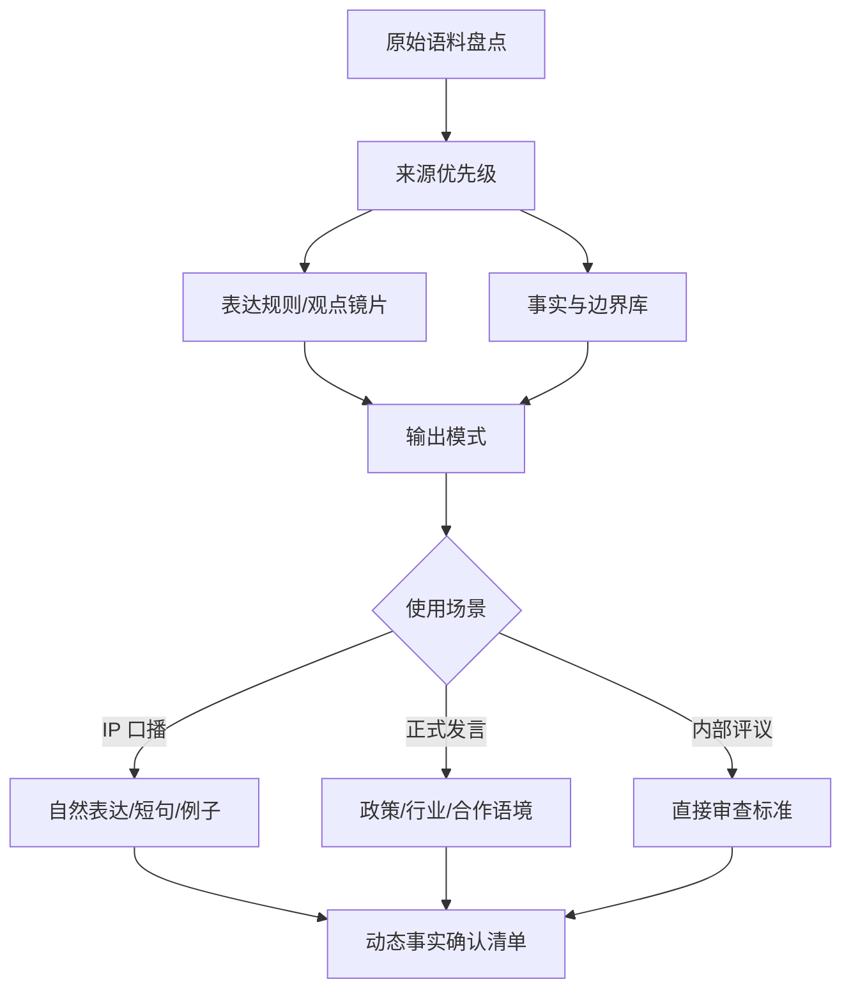

# 品牌声音 Skill 模板（脱敏案例）

## 项目定位

一个将品牌人物表达材料转化为可复用 AI Skill 的方法模板。重点不是模仿口吻，而是把表达规则、事实边界、输出模式和审核标准结构化。

## 背景问题

品牌团队常需要生成 IP 口播、正式发言稿、内部方案评议、战略签约稿和公关稿修改意见。如果只把旧稿交给 AI，容易出现口吻相似但判断逻辑不对、编造经历或数据、不区分正式场合和口播场合、动态事实过期等问题。

## 方案结构

## 核心机制

- **来源优先级**：原声 > 公开采访 > 正式发言 > 运营提炼。
- **表达 DNA**：保留思考方式，而不是机械复制金句。
- **输出模式**：IP 口播、正式发言、内部评议分开处理。
- **事实边界**：动态数字、荣誉、政策、合作进展必须核验。
- **风险提示**：不确定事实输出确认清单，不自动编造。

## 个人职责

- 设计 Skill 结构、触发边界和输出模式
- 梳理表达规则、事实规则、引用规范和核验机制
- 设计测试场景，将一次性写稿经验沉淀为可复用工具

## 公开边界

本案例不包含真实人物原声、内部事实库、品牌战略目标、业务数字、会议材料或运营提炼稿。

## 可迁移价值

可用于企业 IP 内容生产、品牌文稿风格统一、内部审稿标准沉淀和表达资产结构化。
